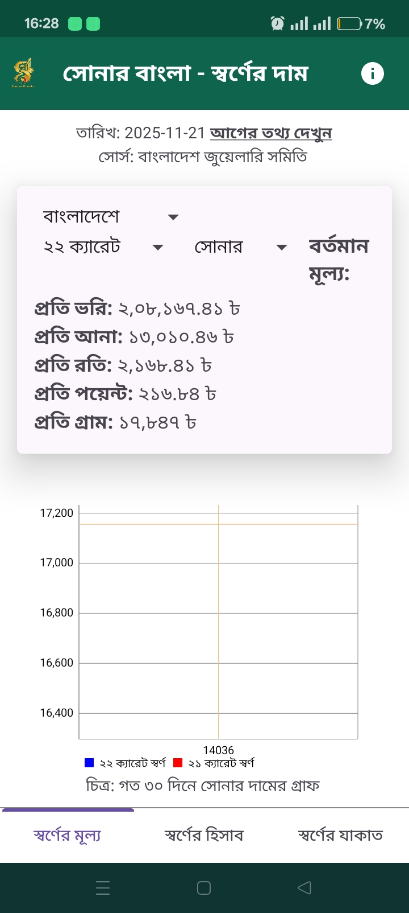
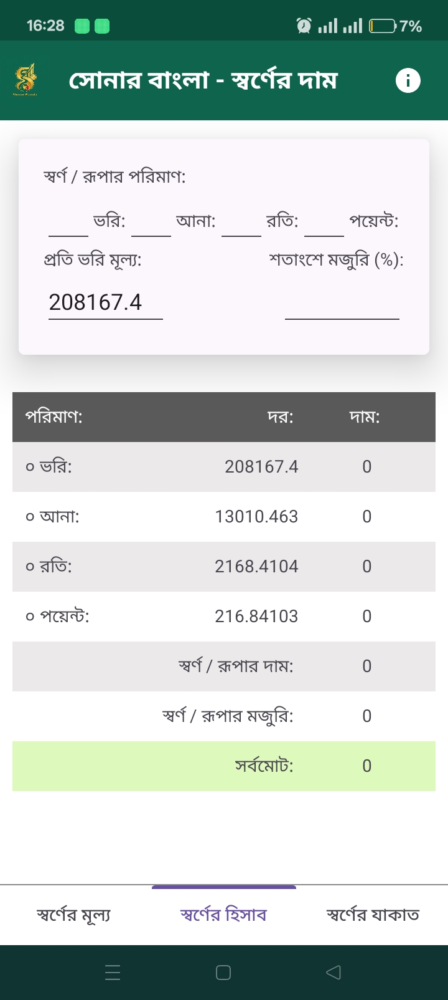
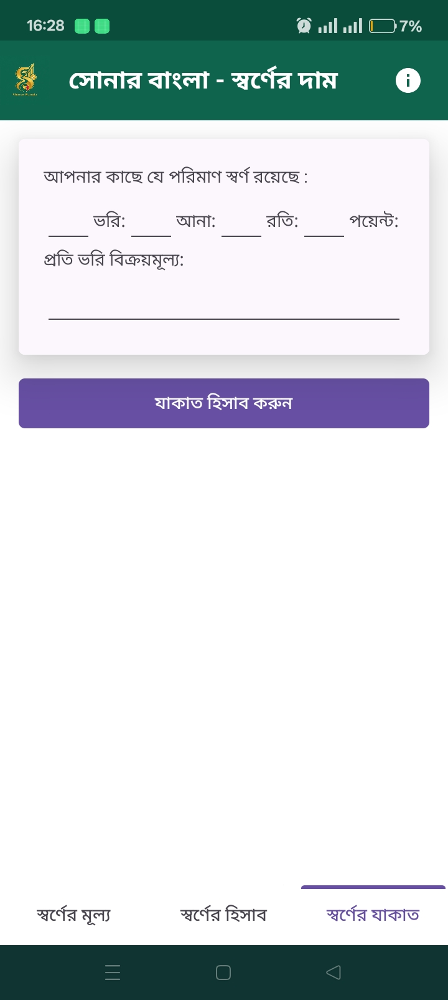
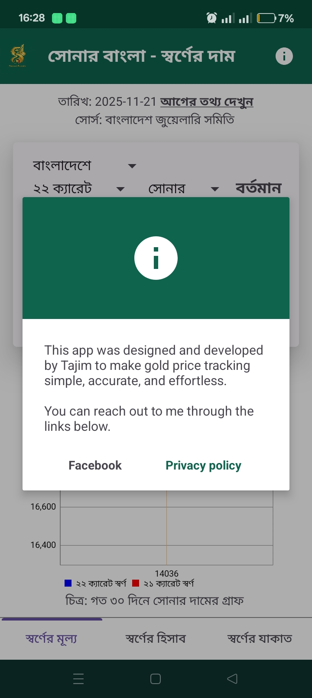

# 🪙 Shonar Bangla

**Shonar Bangla** is an Android application that allows users to view **Bangladesh (BD) and international gold prices** in a simple, offline‑friendly way. The app collects gold price data from **publicly available sources**, processes it, and stores it locally using **SQLite** for fast access and reliability.

---

## 📱 Features

* 🇧🇩 **Bangladesh gold prices** (local market)
* 🌍 **International gold prices**
* 💾 **Offline access** using SQLite database
* ⚡ Fast loading and lightweight
* 📊 Clean and simple UI
* 🔄 Periodic data update from public sources
* 📈 Price history & charts

---

## 🛠️ Tech Stack

* **Platform:** Android
* **Language:** Java
* **UI:** XML (ConstraintLayout)
* **Database:** SQLite
* **Data Source:** Publicly available online sources (scraped & processed)

---

## 📸 Screenshots

<p float="left">
  
  
  
  
</p>
---

## 📂 Project Structure (Simplified)

```
ShonarBangla/
├── app/
│   ├── src/main/java/
│   ├── src/main/res/
│   └── AndroidManifest.xml
├── screenshots/
├── README.md
└── build.gradle
```

---

## 🚀 Installation

1. Clone the repository:

   ```bash
   git clone https://github.com/your-username/ShonarBangla.git
   ```
2. Open the project in **Android Studio**
3. Sync Gradle
4. Run on a real device or emulator

---

## ⚠️ Disclaimer

* This app uses **publicly available data sources**.
* Gold prices may **not be 100% accurate or real‑time**.
* This app is intended for **informational purposes only**, not for trading or investment decisions.

---

## 📌 Future Improvements

* ⏱️ Real‑time price updates
* 🔔 Price alert notifications
* ☁️ Cloud sync support

---

## 👨‍💻 Developer

**Tajim**
Programmer | Android Developer | Tech Enthusiast


* 🐙 GitHub: [https://github.com/tajimz](https://github.com/tajimz)

---

⭐ If you find this project useful, consider giving it a star!
